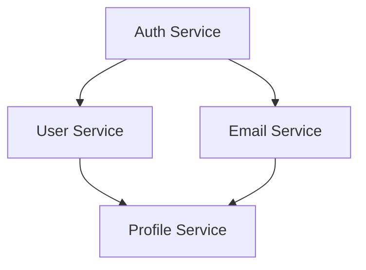
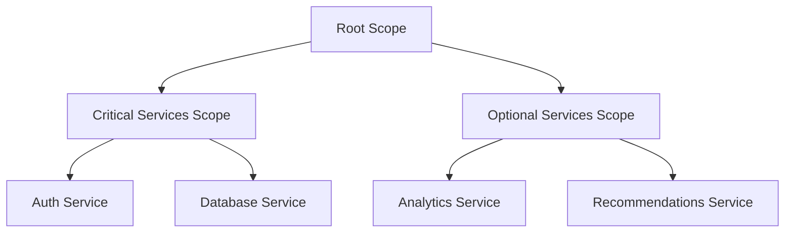

# Cancellation Scopes Guide

This guide covers advanced cancellation patterns using hierarchical cancellation scopes in Veggerby.Ignition.

## Table of Contents

- [Overview](#overview)
- [ICancellationScope and IScopedIgnitionSignal](#icancellationscope-and-iscopedignitionsignal)
- [Bundle-Scoped Cancellation](#bundle-scoped-cancellation)
- [Dependency-Triggered Cancellation](#dependency-triggered-cancellation)
- [CancelDependentsOnFailure Option](#canceldependentsonfailure-option)
- [Hierarchical Cancellation Trees](#hierarchical-cancellation-trees)
- [Real-World Scenarios](#real-world-scenarios)
- [Best Practices](#best-practices)

## Overview

Cancellation scopes provide fine-grained control over shutdown cascades and failure propagation beyond the flat global/per-signal timeout model. With scopes, you can:

- **Group signals**: Cancel all signals in a bundle when one fails
- **Hierarchical cancellation**: Parent scope cancellation propagates to child scopes
- **Dependency cascades**: Cancel all dependent signals when a dependency fails
- **Stage-based cancellation**: Cancel entire stages independently

### When to Use Cancellation Scopes

✅ **Use scopes when:**

- You want bundle-level failure propagation (all Redis signals cancelled if Redis connection fails)
- You need staged cancellation (cancel "warmup" stage if "critical" stage fails)
- You want dependency-aware cancellation (cancel email service if authentication service fails)
- You need structured cancellation trees (microservice dependencies)

❌ **Don't use scopes when:**

- Simple global timeout is sufficient
- Signals are completely independent
- You don't need cascading cancellation

## ICancellationScope and IScopedIgnitionSignal

### ICancellationScope Interface

Represents a hierarchical cancellation scope:

```csharp
public interface ICancellationScope : IDisposable
{
    /// <summary>
    /// Gets the unique name identifying this cancellation scope.
    /// </summary>
    string Name { get; }

    /// <summary>
    /// Gets the parent scope, or null if this is a root scope.
    /// </summary>
    ICancellationScope? Parent { get; }

    /// <summary>
    /// Gets the cancellation token associated with this scope.
    /// </summary>
    CancellationToken Token { get; }

    /// <summary>
    /// Gets whether this scope has been cancelled.
    /// </summary>
    bool IsCancelled { get; }

    /// <summary>
    /// Gets the reason why this scope was cancelled.
    /// </summary>
    CancellationReason CancellationReason { get; }

    /// <summary>
    /// Gets the name of the signal that triggered the cancellation.
    /// </summary>
    string? TriggeringSignalName { get; }

    /// <summary>
    /// Cancels this scope with the specified reason.
    /// </summary>
    void Cancel(CancellationReason reason, string? triggeringSignalName = null);

    /// <summary>
    /// Creates a child scope that inherits cancellation from this scope.
    /// </summary>
    ICancellationScope CreateChildScope(string name);
}
```

### CancellationReason Enum

```csharp
public enum CancellationReason
{
    None,                 // Not cancelled
    GlobalTimeout,        // Global timeout elapsed
    SignalTimeout,        // Per-signal timeout elapsed
    SignalFailure,        // Signal failed/threw exception
    DependencyFailure,    // Dependency failed (DAG mode)
    ManualCancellation    // Explicitly cancelled
}
```

### IScopedIgnitionSignal Interface

Signals can opt into scope-based cancellation:

```csharp
public interface IScopedIgnitionSignal : IIgnitionSignal
{
    /// <summary>
    /// Gets the cancellation scope this signal belongs to.
    /// </summary>
    ICancellationScope? CancellationScope { get; }

    /// <summary>
    /// Gets whether this signal should trigger cancellation of its scope when it fails or times out.
    /// </summary>
    bool CancelScopeOnFailure { get; }
}
```

### Creating a Scoped Signal

```csharp
public sealed class ScopedDatabaseSignal : IScopedIgnitionSignal
{
    private readonly ICancellationScope _scope;
    private readonly IDbConnection _connection;

    public ScopedDatabaseSignal(ICancellationScope scope, IDbConnection connection)
    {
        _scope = scope ?? throw new ArgumentNullException(nameof(scope));
        _connection = connection ?? throw new ArgumentNullException(nameof(connection));
    }

    public string Name => "database-connection";
    public TimeSpan? Timeout => TimeSpan.FromSeconds(10);
    public ICancellationScope? CancellationScope => _scope;
    public bool CancelScopeOnFailure => true; // Cancel scope if this fails

    public async Task WaitAsync(CancellationToken cancellationToken = default)
    {
        // Use scope's token instead of passed token
        var effectiveToken = _scope.Token;

        try
        {
            await _connection.OpenAsync(effectiveToken);
        }
        catch (Exception ex)
        {
            // Signal failed - scope will be cancelled if CancelScopeOnFailure = true
            throw;
        }
    }
}
```

## Bundle-Scoped Cancellation

Group related signals into a bundle scope so that failure of any critical signal cancels the entire bundle.

### Example: Redis Bundle with Scope

```csharp
using Veggerby.Ignition;

public sealed class RedisBundleWithScope
{
    public static void RegisterRedisSignals(
        IServiceCollection services,
        string scopeName = "redis-bundle")
    {
        // Create a shared scope for all Redis signals
        services.AddSingleton<ICancellationScope>(sp =>
            new CancellationScope(scopeName));

        // Redis connection signal (critical - cancel scope on failure)
        services.AddSingleton<IIgnitionSignal>(sp =>
        {
            var scope = sp.GetRequiredService<ICancellationScope>();
            var connection = sp.GetRequiredService<IConnectionMultiplexer>();
            return new RedisConnectionSignal(scope, connection, cancelScopeOnFailure: true);
        });

        // Redis warmup signal (non-critical - don't cancel scope on failure)
        services.AddSingleton<IIgnitionSignal>(sp =>
        {
            var scope = sp.GetRequiredService<ICancellationScope>();
            var connection = sp.GetRequiredService<IConnectionMultiplexer>();
            return new RedisWarmupSignal(scope, connection, cancelScopeOnFailure: false);
        });

        // Redis health check signal (non-critical)
        services.AddSingleton<IIgnitionSignal>(sp =>
        {
            var scope = sp.GetRequiredService<ICancellationScope>();
            var connection = sp.GetRequiredService<IConnectionMultiplexer>();
            return new RedisHealthCheckSignal(scope, connection, cancelScopeOnFailure: false);
        });
    }
}

// Usage
builder.Services.AddIgnition(opts =>
{
    opts.ExecutionMode = IgnitionExecutionMode.Parallel;
    opts.Policy = IgnitionPolicy.BestEffort;
});

RedisBundleWithScope.RegisterRedisSignals(builder.Services);
```

**Behavior:**

- If `RedisConnectionSignal` fails, the scope is cancelled
- `RedisWarmupSignal` and `RedisHealthCheckSignal` receive cancellation and stop
- Other signals outside the scope continue unaffected

### Scoped Signal Implementation

```csharp
public sealed class RedisConnectionSignal : IScopedIgnitionSignal
{
    private readonly ICancellationScope _scope;
    private readonly IConnectionMultiplexer _connection;
    private readonly bool _cancelScopeOnFailure;

    public RedisConnectionSignal(
        ICancellationScope scope,
        IConnectionMultiplexer connection,
        bool cancelScopeOnFailure)
    {
        _scope = scope ?? throw new ArgumentNullException(nameof(scope));
        _connection = connection ?? throw new ArgumentNullException(nameof(connection));
        _cancelScopeOnFailure = cancelScopeOnFailure;
    }

    public string Name => "redis-connection";
    public TimeSpan? Timeout => TimeSpan.FromSeconds(10);
    public ICancellationScope? CancellationScope => _scope;
    public bool CancelScopeOnFailure => _cancelScopeOnFailure;

    public async Task WaitAsync(CancellationToken cancellationToken = default)
    {
        try
        {
            // Use scope token for cancellation coordination
            var token = _scope.Token;

            if (!_connection.IsConnected)
            {
                throw new InvalidOperationException("Redis not connected");
            }

            var db = _connection.GetDatabase();
            await db.PingAsync();
        }
        catch (Exception)
        {
            // Exception will trigger scope cancellation if CancelScopeOnFailure = true
            throw;
        }
    }
}
```

## Dependency-Triggered Cancellation

In DAG (dependency-aware) execution mode, use scopes to cancel dependent signals when dependencies fail.

### Example: Multi-Service Dependency Graph



```csharp
// Create scope for services that depend on Auth
var authScope = new CancellationScope("auth-dependent-services");
var authChildScope = authScope.CreateChildScope("downstream-services");

// Register signals
builder.Services.AddSingleton<IIgnitionSignal>(sp =>
    new AuthServiceSignal(authScope, cancelScopeOnFailure: true)); // Cancel scope if auth fails

builder.Services.AddSingleton<IIgnitionSignal>(sp =>
    new UserServiceSignal(authScope)); // Uses auth scope - cancelled if auth fails

builder.Services.AddSingleton<IIgnitionSignal>(sp =>
    new EmailServiceSignal(authScope)); // Uses auth scope - cancelled if auth fails

builder.Services.AddSingleton<IIgnitionSignal>(sp =>
    new ProfileServiceSignal(authChildScope)); // Child scope - cancelled if any parent fails

// Configure dependency graph
builder.Services.AddIgnitionGraph((graphBuilder, sp) =>
{
    var signals = sp.GetServices<IIgnitionSignal>().ToArray();
    var auth = signals.First(s => s.Name == "auth-service");
    var user = signals.First(s => s.Name == "user-service");
    var email = signals.First(s => s.Name == "email-service");
    var profile = signals.First(s => s.Name == "profile-service");

    graphBuilder.AddSignals(signals);
    graphBuilder.DependsOn(user, auth);
    graphBuilder.DependsOn(email, auth);
    graphBuilder.DependsOn(profile, user);
    graphBuilder.DependsOn(profile, email);
});
```

**Behavior:**

- If `auth-service` fails, it cancels the `authScope`
- `user-service` and `email-service` receive cancellation (both use `authScope`)
- `profile-service` receives cancellation (uses child scope of `authScope`)
- Result shows `profile-service`, `user-service`, `email-service` as cancelled due to auth failure

## CancelDependentsOnFailure Option

The `CancelDependentsOnFailure` option enables automatic cancellation of dependent signals in DAG mode.

### Configuration

```csharp
builder.Services.AddIgnition(opts =>
{
    opts.ExecutionMode = IgnitionExecutionMode.DependencyAware;
    opts.CancelDependentsOnFailure = true; // Enable dependency cancellation
    opts.Policy = IgnitionPolicy.BestEffort;
});
```

### Behavior Comparison

| CancelDependentsOnFailure | Dependency Fails | Dependent Signal Status |
|---------------------------|------------------|------------------------|
| `false` (default) | Failed | `Skipped` |
| `true` | Failed | `TimedOut` (cancelled) |

### Example Without CancelDependentsOnFailure

```csharp
builder.Services.AddIgnition(opts =>
{
    opts.ExecutionMode = IgnitionExecutionMode.DependencyAware;
    opts.CancelDependentsOnFailure = false; // Default
});

// Register signals with dependencies
builder.Services.AddIgnitionFromTask("database", ct => ConnectDatabaseAsync(ct));
builder.Services.AddIgnitionFromTask("cache", ct => ConnectCacheAsync(ct));

builder.Services.AddIgnitionGraph((graphBuilder, sp) =>
{
    var signals = sp.GetServices<IIgnitionSignal>().ToArray();
    var database = signals.First(s => s.Name == "database");
    var cache = signals.First(s => s.Name == "cache");

    graphBuilder.AddSignals(signals);
    graphBuilder.DependsOn(cache, database); // Cache depends on database
});

var result = await coordinator.GetResultAsync();

// If database fails:
// - database: Status = Failed
// - cache: Status = Skipped (not cancelled, just not started)
```

### Example With CancelDependentsOnFailure

```csharp
builder.Services.AddIgnition(opts =>
{
    opts.ExecutionMode = IgnitionExecutionMode.DependencyAware;
    opts.CancelDependentsOnFailure = true; // Enable cancellation
});

// Same signal registration and graph setup...

var result = await coordinator.GetResultAsync();

// If database fails:
// - database: Status = Failed
// - cache: Status = TimedOut (actively cancelled via CancellationToken)
```

### Use Cases

✅ **Enable CancelDependentsOnFailure when:**

- You want explicit cancellation notification in dependent signals
- Dependent signals have cleanup logic triggered by cancellation tokens
- You need accurate "cancelled due to dependency" reporting

❌ **Disable CancelDependentsOnFailure when:**

- Simple skipping is sufficient (default behavior)
- Dependent signals don't handle cancellation tokens
- You want to minimize cancellation token activity

## Hierarchical Cancellation Trees

Create parent-child scope relationships for structured cancellation propagation.

### Example: Multi-Tier Service Architecture



```csharp
// Create root scope
var rootScope = new CancellationScope("application-root");

// Create child scopes
var criticalScope = rootScope.CreateChildScope("critical-services");
var optionalScope = rootScope.CreateChildScope("optional-services");

// Register critical services with critical scope
builder.Services.AddSingleton<IIgnitionSignal>(sp =>
    new AuthServiceSignal(criticalScope, cancelScopeOnFailure: true));

builder.Services.AddSingleton<IIgnitionSignal>(sp =>
    new DatabaseServiceSignal(criticalScope, cancelScopeOnFailure: true));

// Register optional services with optional scope
builder.Services.AddSingleton<IIgnitionSignal>(sp =>
    new AnalyticsServiceSignal(optionalScope, cancelScopeOnFailure: false));

builder.Services.AddSingleton<IIgnitionSignal>(sp =>
    new RecommendationsServiceSignal(optionalScope, cancelScopeOnFailure: false));

// Configure ignition
builder.Services.AddIgnition(opts =>
{
    opts.ExecutionMode = IgnitionExecutionMode.Parallel;
    opts.Policy = IgnitionPolicy.BestEffort;
});
```

**Cancellation Behavior:**

| Event | Critical Scope | Optional Scope | Auth | Database | Analytics | Recommendations |
|-------|----------------|----------------|------|----------|-----------|-----------------|
| Auth fails (CancelScopeOnFailure=true) | Cancelled | Not affected | Failed | Cancelled | Running | Running |
| Database fails (CancelScopeOnFailure=true) | Cancelled | Not affected | Cancelled | Failed | Running | Running |
| Analytics fails (CancelScopeOnFailure=false) | Not affected | Not affected | Running | Running | Failed | Running |
| Root scope cancelled manually | Cancelled | Cancelled | Cancelled | Cancelled | Cancelled | Cancelled |

### Manual Scope Cancellation

```csharp
// Cancel critical scope manually (e.g., based on external condition)
if (externalHealthCheckFailed)
{
    criticalScope.Cancel(
        CancellationReason.ManualCancellation,
        triggeringSignalName: "external-health-check");
}

var result = await coordinator.GetResultAsync();

// Inspect cancellation reason
foreach (var signalResult in result.Results)
{
    if (signalResult.Status == IgnitionSignalStatus.TimedOut)
    {
        var scopedSignal = signals.FirstOrDefault(s => s.Name == signalResult.Name) as IScopedIgnitionSignal;
        if (scopedSignal?.CancellationScope != null)
        {
            var reason = scopedSignal.CancellationScope.CancellationReason;
            var trigger = scopedSignal.CancellationScope.TriggeringSignalName;
            Console.WriteLine($"{signalResult.Name} cancelled due to {reason} (triggered by {trigger})");
        }
    }
}
```

## Real-World Scenarios

### Scenario 1: Microservice Startup with Bundle Scopes

```csharp
// Create separate scopes for each infrastructure component
var redisScope = new CancellationScope("redis-infrastructure");
var messagingScope = new CancellationScope("messaging-infrastructure");
var databaseScope = new CancellationScope("database-infrastructure");

// Redis signals (connection is critical, warmup is not)
builder.Services.AddSingleton<IIgnitionSignal>(sp =>
    new RedisConnectionSignal(redisScope, sp.GetRequiredService<IConnectionMultiplexer>(), cancelScopeOnFailure: true));

builder.Services.AddSingleton<IIgnitionSignal>(sp =>
    new RedisWarmupSignal(redisScope, sp.GetRequiredService<IConnectionMultiplexer>(), cancelScopeOnFailure: false));

// Messaging signals (connection is critical, consumer setup is not)
builder.Services.AddSingleton<IIgnitionSignal>(sp =>
    new RabbitMqConnectionSignal(messagingScope, sp.GetRequiredService<IConnection>(), cancelScopeOnFailure: true));

builder.Services.AddSingleton<IIgnitionSignal>(sp =>
    new RabbitMqConsumerSignal(messagingScope, sp.GetRequiredService<IConnection>(), cancelScopeOnFailure: false));

// Database signals (all critical)
builder.Services.AddSingleton<IIgnitionSignal>(sp =>
    new DatabaseConnectionSignal(databaseScope, sp.GetRequiredService<IDbConnection>(), cancelScopeOnFailure: true));

builder.Services.AddSingleton<IIgnitionSignal>(sp =>
    new DatabaseMigrationSignal(databaseScope, sp.GetRequiredService<IDbConnection>(), cancelScopeOnFailure: true));
```

**Outcome:**

- Redis connection fails → Redis warmup cancelled (but messaging and database continue)
- RabbitMQ connection fails → RabbitMQ consumer cancelled (but Redis and database continue)
- Database connection fails → Database migration cancelled (but Redis and messaging continue)

### Scenario 2: Staged Execution with Scope per Stage

```csharp
// Create scope per stage
var infrastructureScope = new CancellationScope("infrastructure-stage");
var warmupScope = infrastructureScope.CreateChildScope("warmup-stage");
var readinessScope = warmupScope.CreateChildScope("readiness-stage");

// Infrastructure stage (critical)
builder.Services.AddSingleton<IIgnitionSignal>(sp =>
    new DatabaseSignal(infrastructureScope, cancelScopeOnFailure: true));

builder.Services.AddSingleton<IIgnitionSignal>(sp =>
    new CacheSignal(infrastructureScope, cancelScopeOnFailure: true));

// Warmup stage (depends on infrastructure, less critical)
builder.Services.AddSingleton<IIgnitionSignal>(sp =>
    new DataPreloadSignal(warmupScope, cancelScopeOnFailure: false));

// Readiness stage (depends on warmup)
builder.Services.AddSingleton<IIgnitionSignal>(sp =>
    new HealthCheckSignal(readinessScope, cancelScopeOnFailure: false));

builder.Services.AddIgnition(opts =>
{
    opts.ExecutionMode = IgnitionExecutionMode.Staged;
    opts.StagePolicy = IgnitionStagePolicy.AllMustSucceed;
});
```

**Outcome:**

- Infrastructure failure → Warmup and Readiness stages cancelled
- Warmup failure → Readiness stage cancelled (infrastructure unaffected)
- Readiness failure → No cascading cancellation

## Best Practices

### 1. Scope Naming

Use descriptive, hierarchical names:

```csharp
// Good: Clear hierarchy
var root = new CancellationScope("application");
var infrastructure = root.CreateChildScope("infrastructure");
var database = infrastructure.CreateChildScope("database");

// Bad: Unclear relationship
var scope1 = new CancellationScope("scope1");
var scope2 = scope1.CreateChildScope("scope2");
```

### 2. CancelScopeOnFailure Usage

Only set `CancelScopeOnFailure = true` for critical signals:

```csharp
// Critical: Connection must succeed for bundle to work
new DatabaseConnectionSignal(scope, cancelScopeOnFailure: true);

// Non-critical: Warmup can fail without affecting other signals
new DatabaseWarmupSignal(scope, cancelScopeOnFailure: false);
```

### 3. Scope Disposal

Scopes implement `IDisposable`. Dispose properly:

```csharp
// Option 1: Register as singleton (DI handles disposal)
builder.Services.AddSingleton<ICancellationScope>(sp =>
    new CancellationScope("my-scope"));

// Option 2: Manual disposal
using var scope = new CancellationScope("my-scope");
// Use scope...
```

### 4. Combine with CancelDependentsOnFailure

For DAG mode, use scopes for bundle cancellation and `CancelDependentsOnFailure` for dependency cascades:

```csharp
builder.Services.AddIgnition(opts =>
{
    opts.ExecutionMode = IgnitionExecutionMode.DependencyAware;
    opts.CancelDependentsOnFailure = true; // Dependency cascades
});

// Bundle scope for infrastructure
var infraScope = new CancellationScope("infrastructure");
builder.Services.AddSingleton<IIgnitionSignal>(sp =>
    new InfraSignal(infraScope, cancelScopeOnFailure: true));
```

### 5. Logging Cancellation Reasons

Log cancellation context for diagnostics:

```csharp
var result = await coordinator.GetResultAsync();

foreach (var signalResult in result.Results.Where(r => r.Status == IgnitionSignalStatus.TimedOut))
{
    var signal = signals.FirstOrDefault(s => s.Name == signalResult.Name) as IScopedIgnitionSignal;
    if (signal?.CancellationScope != null && signal.CancellationScope.IsCancelled)
    {
        logger.LogWarning(
            "Signal {Name} cancelled: Reason={Reason}, Trigger={Trigger}, Scope={Scope}",
            signalResult.Name,
            signal.CancellationScope.CancellationReason,
            signal.CancellationScope.TriggeringSignalName,
            signal.CancellationScope.Name);
    }
}
```

### 6. Testing Scoped Signals

Test cancellation propagation:

```csharp
[Fact]
public async Task Signal_CancelsScopeOnFailure()
{
    // arrange
    var scope = new CancellationScope("test-scope");
    var signal = new MySignal(scope, cancelScopeOnFailure: true);

    // act
    var exception = await Record.ExceptionAsync(() => signal.WaitAsync());

    // assert
    Assert.NotNull(exception);
    Assert.True(scope.IsCancelled);
    Assert.Equal(CancellationReason.SignalFailure, scope.CancellationReason);
    Assert.Equal("my-signal", scope.TriggeringSignalName);
}

[Fact]
public async Task ChildScope_CancelledWhenParentCancelled()
{
    // arrange
    var parent = new CancellationScope("parent");
    var child = parent.CreateChildScope("child");

    // act
    parent.Cancel(CancellationReason.ManualCancellation);

    // assert
    Assert.True(parent.IsCancelled);
    Assert.True(child.IsCancelled);
    Assert.True(child.Token.IsCancellationRequested);
}
```

## Related Documentation

- [Bundles Guide](bundles.md) - Bundle-scoped signal grouping
- [Dependency-Aware Execution](dependency-aware-execution.md) - DAG mode and dependency graphs
- [Timeout Management](timeout-management.md) - Timeout vs cancellation semantics
- [Policies](policies.md) - Failure handling and continuation policies
- [API Reference](api-reference.md) - ICancellationScope and IScopedIgnitionSignal reference
