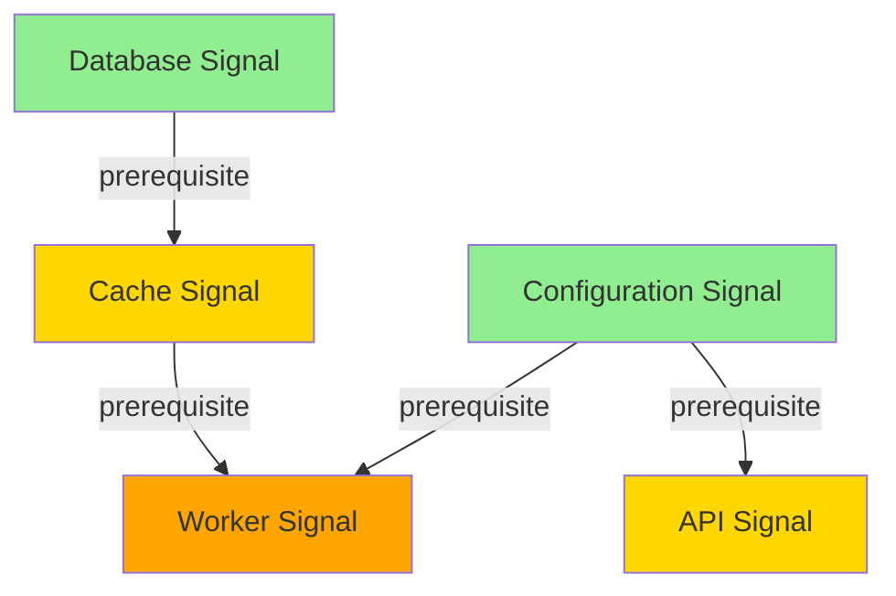
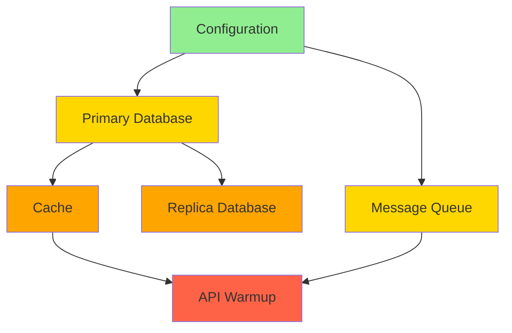

# Dependency-Aware Execution Guide

This guide covers Veggerby.Ignition's dependency-aware execution mode, which automatically orders signal execution based on declared dependencies using a directed acyclic graph (DAG).

## Overview

Dependency-aware execution mode solves the problem of coordinating startup tasks that have prerequisite relationships. Instead of manually sequencing signals or running everything in parallel, you declare dependencies and let Ignition determine the optimal execution order.

### When to Use DAG Mode

Use dependency-aware execution when:

- ✅ **Signals have prerequisites**: Cache requires database, worker requires cache
- ✅ **Mixed dependencies**: Some signals are independent, others form chains
- ✅ **Optimal parallelism desired**: Independent branches should run concurrently
- ✅ **Failure isolation needed**: Failed signals should skip only their dependents

**Don't use** DAG mode when:

- ❌ **All signals are independent**: Use `Parallel` mode instead
- ❌ **Simple linear sequence**: Use `Sequential` mode instead
- ❌ **No clear dependencies**: Dependencies would be arbitrary

### Comparison with Other Modes

| Mode | Use When | Execution Order | Independent Signals |
|------|----------|----------------|---------------------|
| Parallel | No dependencies | All at once | All concurrent |
| Sequential | Simple linear order | Registration order | One at a time |
| DependencyAware | Complex dependencies | Topological sort | Parallel if independent |

## Enabling DAG Mode

Configure execution mode in your ignition options:

```csharp
builder.Services.AddIgnition(options =>
{
    options.ExecutionMode = IgnitionExecutionMode.DependencyAware;
    options.GlobalTimeout = TimeSpan.FromSeconds(30);
    options.MaxDegreeOfParallelism = 4; // Optional concurrency limit
});
```

## Declaring Dependencies

Veggerby.Ignition supports two approaches for declaring dependencies: attribute-based (declarative) and programmatic (fluent API).

### Attribute-Based Dependencies

Use the `[SignalDependency]` attribute for declarative dependency specification:

```csharp
// No dependencies - this is a root signal
public class DatabaseSignal : IIgnitionSignal
{
    public string Name => "database";
    public TimeSpan? Timeout => TimeSpan.FromSeconds(10);

    public async Task WaitAsync(CancellationToken ct)
    {
        // Connect to database
        await _connection.OpenAsync(ct);
    }
}

// Depends on "database" signal
[SignalDependency("database")]
public class CacheSignal : IIgnitionSignal
{
    public string Name => "cache";
    public TimeSpan? Timeout => TimeSpan.FromSeconds(5);

    public async Task WaitAsync(CancellationToken ct)
    {
        // Warm cache (requires database connection)
        await _cache.WarmFromDatabaseAsync(ct);
    }
}

// Depends on "cache" signal (which depends on "database")
[SignalDependency("cache")]
public class WorkerSignal : IIgnitionSignal
{
    public string Name => "worker";
    public TimeSpan? Timeout => null;

    public async Task WaitAsync(CancellationToken ct)
    {
        // Start worker (requires warmed cache)
        await _worker.StartAsync(ct);
    }
}
```

#### Multiple Dependencies

Use multiple attributes for signals with multiple prerequisites:

```csharp
// Configuration must load first
public class ConfigurationSignal : IIgnitionSignal
{
    public string Name => "configuration";
    // ...
}

// Worker depends on BOTH cache AND configuration
[SignalDependency("cache")]
[SignalDependency("configuration")]
public class WorkerSignal : IIgnitionSignal
{
    public string Name => "worker";
    // ...
}
```

#### Dependency by Type

Reference signals by type instead of name:

```csharp
[SignalDependency(typeof(DatabaseSignal))]
public class CacheSignal : IIgnitionSignal
{
    // ...
}
```

#### Apply Attribute Dependencies

Wire up attribute-based dependencies in your graph configuration:

```csharp
builder.Services.AddIgnitionSignal<DatabaseSignal>();
builder.Services.AddIgnitionSignal<CacheSignal>();
builder.Services.AddIgnitionSignal<WorkerSignal>();

builder.Services.AddIgnitionGraph((graphBuilder, sp) =>
{
    var signals = sp.GetServices<IIgnitionSignal>();
    graphBuilder.AddSignals(signals);
    graphBuilder.ApplyAttributeDependencies(); // Discovers and applies [SignalDependency]
});
```

### Programmatic Dependencies (Fluent API)

Use the fluent builder API for dynamic or complex dependency scenarios:

```csharp
builder.Services.AddIgnitionGraph((graphBuilder, sp) =>
{
    var signals = sp.GetServices<IIgnitionSignal>();
    var db = signals.First(s => s.Name == "database");
    var cache = signals.First(s => s.Name == "cache");
    var worker = signals.First(s => s.Name == "worker");

    graphBuilder.AddSignals(new[] { db, cache, worker });

    // Define dependencies
    graphBuilder.DependsOn(cache, db);      // cache depends on database
    graphBuilder.DependsOn(worker, cache);  // worker depends on cache
});
```

#### Multiple Dependencies

```csharp
graphBuilder.DependsOn(worker, cache, configuration); // worker depends on both
```

#### Dynamic Dependencies

Build dependencies based on runtime conditions:

```csharp
builder.Services.AddIgnitionGraph((graphBuilder, sp) =>
{
    var signals = sp.GetServices<IIgnitionSignal>().ToList();
    graphBuilder.AddSignals(signals);

    var config = sp.GetRequiredService<IConfiguration>();
    var enableReplication = config.GetValue<bool>("Database:EnableReplication");

    var primary = signals.First(s => s.Name == "database-primary");
    var cache = signals.First(s => s.Name == "cache");

    graphBuilder.DependsOn(cache, primary);

    if (enableReplication)
    {
        var replica = signals.First(s => s.Name == "database-replica");
        graphBuilder.DependsOn(replica, primary); // replica depends on primary
    }
});
```

## Understanding Topological Sort

The coordinator uses topological sort to determine execution order. This algorithm:

1. Identifies all signals with no dependencies (root signals)
2. Executes root signals in parallel
3. As each signal completes, marks dependents as ready if all prerequisites are met
4. Continues until all signals complete or a failure occurs

### Execution Flow Example

Given this dependency graph:

```text
     Database      Configuration
        |             /      \
      Cache          /        \
        |           /          \
        +------  Worker        API
```

**Execution order**:

1. **Wave 1** (parallel): `Database`, `Configuration` start simultaneously
2. **Wave 2**: `Cache` starts after `Database` completes; `API` starts after `Configuration` completes
3. **Wave 3**: `Worker` starts after BOTH `Cache` AND `Configuration` complete

Here's a mermaid diagram visualizing this:



## Cycle Detection

DAG execution requires an acyclic graph. Veggerby.Ignition validates this during graph construction.

### Detecting Cycles

If you create a circular dependency, you'll get a clear error:

```csharp
[SignalDependency("cache")]
public class DatabaseSignal : IIgnitionSignal { /* ... */ }

[SignalDependency("worker")]
public class CacheSignal : IIgnitionSignal { /* ... */ }

[SignalDependency("database")]
public class WorkerSignal : IIgnitionSignal { /* ... */ }

// Throws: InvalidOperationException
// "Ignition graph contains a cycle: database -> cache -> worker -> database.
//  Dependency-aware execution requires an acyclic graph."
```

### Troubleshooting Cycles

If you encounter a cycle error:

1. **Review the cycle path** shown in the error message
2. **Identify the unnecessary dependency**: Which link can be removed?
3. **Restructure dependencies**: Consider extracting shared initialization into a common signal
4. **Use events/callbacks**: If signals need bidirectional communication, use events instead of dependencies

### Example: Breaking a Cycle

**Problem**: Database needs configuration, configuration needs cache, cache needs database (cycle!)

**Solution**: Extract configuration loading as a root signal:

```csharp
// No dependencies
public class ConfigurationSignal : IIgnitionSignal
{
    public string Name => "configuration";
    // Load config from file/env vars
}

// Depends on configuration
[SignalDependency("configuration")]
public class DatabaseSignal : IIgnitionSignal
{
    public string Name => "database";
    // Connect using loaded config
}

// Depends on database
[SignalDependency("database")]
public class CacheSignal : IIgnitionSignal
{
    public string Name => "cache";
    // Warm cache from database
}
```

## Failure Propagation

When a signal fails in DAG mode, all dependent signals are automatically skipped.

### Example

```csharp
var result = await coordinator.GetResultAsync();

foreach (var r in result.Results)
{
    switch (r.Status)
    {
        case IgnitionSignalStatus.Succeeded:
            Console.WriteLine($"✓ {r.Name} completed in {r.Duration.TotalMilliseconds:F0}ms");
            break;

        case IgnitionSignalStatus.Failed:
            Console.WriteLine($"✗ {r.Name} failed: {r.Exception?.Message}");
            break;

        case IgnitionSignalStatus.Skipped:
            Console.WriteLine($"⊘ {r.Name} skipped (failed dependencies: {string.Join(", ", r.FailedDependencies)})");
            break;

        case IgnitionSignalStatus.TimedOut:
            Console.WriteLine($"⏱ {r.Name} timed out");
            break;
    }
}
```

### Failure Propagation Behavior

Given:

```text
Database → Cache → Worker
```

If `Database` fails:

- ✅ `Database` reports `Status = Failed`
- ⊘ `Cache` reports `Status = Skipped`, `FailedDependencies = ["database"]`
- ⊘ `Worker` reports `Status = Skipped`, `FailedDependencies = ["cache"]`

Note: `Worker` shows `cache` as the failed dependency (immediate prerequisite), not `database` (transitive prerequisite).

## Performance Considerations

### Automatic Parallelism

Independent branches execute in parallel automatically:

```text
    Database
       |
     Cache ----+
                |
 Configuration--+---- Worker
       |
     API
```

Execution timeline:

```text
Time →
0s:  [Database starts] [Configuration starts]
2s:  [Database done]
3s:  [Cache starts] [Configuration done]
4s:  [API starts]
5s:  [Cache done]
6s:  [Worker starts] (waits for both Cache and Configuration)
8s:  [API done]
9s:  [Worker done]
```

Both `Cache` → `Worker` and `Configuration` → `API` branches run in parallel.

### Concurrency Limiting

Control parallelism within independent branches:

```csharp
builder.Services.AddIgnition(options =>
{
    options.ExecutionMode = IgnitionExecutionMode.DependencyAware;
    options.MaxDegreeOfParallelism = 2; // Max 2 concurrent signals
});
```

This limits how many signals can run simultaneously, even across independent branches.

### Performance Tips

1. **Minimize dependency chains**: Long chains reduce parallelism
2. **Group independent signals**: Separate from dependency chains for parallel execution
3. **Use bundles**: Pre-packaged signal groups with optimized dependencies
4. **Profile with slow signal logging**:

```csharp
options.SlowHandleLogCount = 5; // Identify bottleneck signals
```

## Complete Worked Examples

### Example 1: Database → Cache → Worker Pipeline

**Scenario**: Worker processes data from cache, which is warmed from database.

```csharp
public class DatabaseConnectionSignal : IIgnitionSignal
{
    private readonly AppDbContext _dbContext;

    public DatabaseConnectionSignal(AppDbContext dbContext)
    {
        _dbContext = dbContext;
    }

    public string Name => "database";
    public TimeSpan? Timeout => TimeSpan.FromSeconds(10);

    public async Task WaitAsync(CancellationToken ct)
    {
        await _dbContext.Database.CanConnectAsync(ct);
    }
}

[SignalDependency("database")]
public class CacheWarmingSignal : IIgnitionSignal
{
    private readonly IDistributedCache _cache;
    private readonly AppDbContext _dbContext;

    public CacheWarmingSignal(IDistributedCache cache, AppDbContext dbContext)
    {
        _cache = cache;
        _dbContext = dbContext;
    }

    public string Name => "cache";
    public TimeSpan? Timeout => TimeSpan.FromSeconds(15);

    public async Task WaitAsync(CancellationToken ct)
    {
        var products = await _dbContext.Products.Take(100).ToListAsync(ct);

        foreach (var product in products)
        {
            await _cache.SetStringAsync(
                $"product:{product.Id}",
                JsonSerializer.Serialize(product),
                ct);
        }
    }
}

[SignalDependency("cache")]
public class WorkerSignal : IIgnitionSignal
{
    private readonly BackgroundWorker _worker;

    public WorkerSignal(BackgroundWorker worker)
    {
        _worker = worker;
    }

    public string Name => "worker";
    public TimeSpan? Timeout => null;

    public async Task WaitAsync(CancellationToken ct)
    {
        await _worker.InitializeAsync(ct);
    }
}

// Registration
builder.Services.AddIgnition(options =>
{
    options.ExecutionMode = IgnitionExecutionMode.DependencyAware;
});

builder.Services.AddIgnitionSignal<DatabaseConnectionSignal>();
builder.Services.AddIgnitionSignal<CacheWarmingSignal>();
builder.Services.AddIgnitionSignal<WorkerSignal>();

builder.Services.AddIgnitionGraph((graphBuilder, sp) =>
{
    var signals = sp.GetServices<IIgnitionSignal>();
    graphBuilder.AddSignals(signals);
    graphBuilder.ApplyAttributeDependencies();
});
```

### Example 2: Multi-Stage Microservice Initialization

**Scenario**: Microservice with configuration, multiple databases, cache, message queue, and API warmup.

```csharp
// Stage 1: Root signals (no dependencies)
public class ConfigSignal : IIgnitionSignal
{
    public string Name => "configuration";
    public TimeSpan? Timeout => TimeSpan.FromSeconds(5);
    public async Task WaitAsync(CancellationToken ct) { /* Load config */ }
}

// Stage 2: Depends on configuration
[SignalDependency("configuration")]
public class PrimaryDbSignal : IIgnitionSignal
{
    public string Name => "database-primary";
    public TimeSpan? Timeout => TimeSpan.FromSeconds(10);
    public async Task WaitAsync(CancellationToken ct) { /* Connect to primary DB */ }
}

[SignalDependency("configuration")]
public class MessageQueueSignal : IIgnitionSignal
{
    public string Name => "message-queue";
    public TimeSpan? Timeout => TimeSpan.FromSeconds(8);
    public async Task WaitAsync(CancellationToken ct) { /* Connect to queue */ }
}

// Stage 3: Depends on primary database
[SignalDependency("database-primary")]
public class ReplicaDbSignal : IIgnitionSignal
{
    public string Name => "database-replica";
    public TimeSpan? Timeout => TimeSpan.FromSeconds(10);
    public async Task WaitAsync(CancellationToken ct) { /* Connect to replica */ }
}

[SignalDependency("database-primary")]
public class CacheSignal : IIgnitionSignal
{
    public string Name => "cache";
    public TimeSpan? Timeout => TimeSpan.FromSeconds(15);
    public async Task WaitAsync(CancellationToken ct) { /* Warm cache */ }
}

// Stage 4: Depends on multiple prerequisites
[SignalDependency("cache")]
[SignalDependency("message-queue")]
public class ApiWarmupSignal : IIgnitionSignal
{
    public string Name => "api-warmup";
    public TimeSpan? Timeout => TimeSpan.FromSeconds(5);
    public async Task WaitAsync(CancellationToken ct) { /* Prime API routes */ }
}
```

Execution flow diagram:



### Example 3: Complex Graph with Multiple Roots and Leaves

**Scenario**: Application with independent subsystems that converge on a final initialization step.

```csharp
// Root signals (independent)
public class AuthServiceSignal : IIgnitionSignal
{
    public string Name => "auth-service";
    // ...
}

public class DatabaseSignal : IIgnitionSignal
{
    public string Name => "database";
    // ...
}

public class StorageSignal : IIgnitionSignal
{
    public string Name => "storage";
    // ...
}

// Middle layer
[SignalDependency("auth-service")]
public class SessionStoreSignal : IIgnitionSignal
{
    public string Name => "session-store";
    // ...
}

[SignalDependency("database")]
public class RepositorySignal : IIgnitionSignal
{
    public string Name => "repository";
    // ...
}

[SignalDependency("storage")]
public class FileIndexSignal : IIgnitionSignal
{
    public string Name => "file-index";
    // ...
}

// Converge: depends on all middle layer signals
[SignalDependency("session-store")]
[SignalDependency("repository")]
[SignalDependency("file-index")]
public class ApplicationReadySignal : IIgnitionSignal
{
    public string Name => "application-ready";
    // Final initialization that needs everything
}
```

## Graph Queries

The graph builder provides methods to inspect the dependency structure:

```csharp
builder.Services.AddIgnitionGraph((graphBuilder, sp) =>
{
    var signals = sp.GetServices<IIgnitionSignal>();
    graphBuilder.AddSignals(signals);
    graphBuilder.ApplyAttributeDependencies();

    // Query the graph
    var roots = graphBuilder.GetRootSignals();
    Console.WriteLine($"Root signals: {string.Join(", ", roots.Select(s => s.Name))}");

    var leaves = graphBuilder.GetLeafSignals();
    Console.WriteLine($"Leaf signals: {string.Join(", ", leaves.Select(s => s.Name))}");

    var cacheSignal = signals.First(s => s.Name == "cache");
    var deps = graphBuilder.GetDependencies(cacheSignal);
    Console.WriteLine($"Cache dependencies: {string.Join(", ", deps.Select(s => s.Name))}");

    var dependents = graphBuilder.GetDependents(cacheSignal);
    Console.WriteLine($"Cache dependents: {string.Join(", ", dependents.Select(s => s.Name))}");
});
```

## Best Practices

### 1. Keep Dependencies Clear and Minimal

Only declare dependencies that are truly required for correctness:

```csharp
// ✓ Good: Cache needs database connection
[SignalDependency("database")]
public class CacheSignal { }

// ✗ Bad: Cache doesn't actually need message queue
[SignalDependency("database")]
[SignalDependency("message-queue")]  // Unnecessary
public class CacheSignal { }
```

### 2. Prefer Attribute-Based for Static Dependencies

Use attributes when dependencies are fixed and known at compile time:

```csharp
[SignalDependency("database")]
public class CacheSignal : IIgnitionSignal { }
```

Use fluent API when dependencies are dynamic or conditional:

```csharp
if (useReplica)
{
    graphBuilder.DependsOn(cache, replicaDb);
}
else
{
    graphBuilder.DependsOn(cache, primaryDb);
}
```

### 3. Design for Parallelism

Minimize long dependency chains to maximize parallel execution:

```csharp
// ✓ Good: Enables parallelism
A → B
C → D

// ✗ Suboptimal: Fully sequential
A → B → C → D
```

### 4. Use Bundles for Common Patterns

Extract reusable dependency patterns into bundles:

```csharp
public class DatabaseStackBundle : IIgnitionBundle
{
    public void ConfigureBundle(IServiceCollection services, Action<IgnitionBundleOptions>? configure)
    {
        services.AddIgnitionSignal<DatabaseConnectSignal>();
        services.AddIgnitionSignal<DatabaseMigrateSignal>();
        services.AddIgnitionSignal<DatabaseSeedSignal>();

        services.AddIgnitionGraph((builder, sp) =>
        {
            var signals = sp.GetServices<IIgnitionSignal>();
            var connect = signals.First(s => s.Name == "db:connect");
            var migrate = signals.First(s => s.Name == "db:migrate");
            var seed = signals.First(s => s.Name == "db:seed");

            builder.AddSignals(new[] { connect, migrate, seed });
            builder.DependsOn(migrate, connect);
            builder.DependsOn(seed, migrate);
        });
    }
}
```

### 5. Document Complex Graphs

For non-trivial dependency structures, include a diagram in comments or docs:

```csharp
/// <summary>
/// Initializes the data layer with the following dependency structure:
///
///       PrimaryDb → ReplicaDb
///           |
///       Migration
///           |
///        Cache → Worker
///
/// Execution: PrimaryDb first, then Migration and ReplicaDb in parallel,
/// then Cache, finally Worker.
/// </summary>
public class DataLayerBundle : IIgnitionBundle { }
```

## Related Topics

- [Getting Started](getting-started.md) - Basic ignition concepts
- [Timeout Management](timeout-management.md) - Handling timeouts in DAG mode
- [Policies](policies.md) - Failure handling with dependencies
- [Bundles](bundles.md) - Creating dependency graphs in bundles
- [Performance Guide](performance.md) - Optimizing DAG execution
