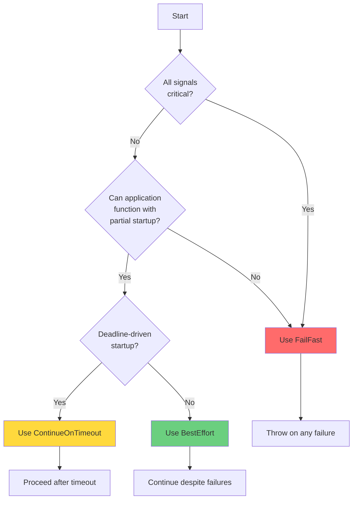

# Policies and Failure Handling

This guide covers Veggerby.Ignition's policy system for controlling how the coordinator responds to signal failures and timeouts.

## Overview

Ignition provides three policies that determine how startup proceeds when signals fail or time out:

- **FailFast**: Abort on first failure (strict mode)
- **BestEffort**: Continue despite failures (resilient mode)
- **ContinueOnTimeout**: Proceed when global timeout elapses (deadline mode)

Choose a policy based on your application's tolerance for partial startup and failure recovery capabilities.

## FailFast Policy

### Behavior

Throws `AggregateException` on the first signal failure. In sequential mode, halts execution immediately. In parallel/DAG modes, collects all failures before throwing.

```csharp
builder.Services.AddIgnition(options =>
{
    options.Policy = IgnitionPolicy.FailFast;
});
```

### When to Use

Use FailFast when:

- ✅ **All signals are critical**: Application cannot function without any signal
- ✅ **No graceful degradation**: Partial startup is unacceptable
- ✅ **Fail-safe behavior**: Better to not start than start incorrectly
- ✅ **Development**: Catch initialization errors early

### Characteristics

- **Exception thrown**: `AggregateException` containing all failed signal exceptions
- **Result inspection**: Result still available via `GetResultAsync()` after catch
- **Sequential mode**: Stops on first failure (subsequent signals not executed)
- **Parallel/DAG mode**: All signals attempt execution, then throws if any failed
- **Timeouts**: Both failures and timeouts trigger FailFast

### Example: Critical Startup

```csharp
builder.Services.AddIgnition(options =>
{
    options.GlobalTimeout = TimeSpan.FromSeconds(30);
    options.Policy = IgnitionPolicy.FailFast;
    options.CancelOnGlobalTimeout = true;
});

builder.Services.AddIgnitionSignal<DatabaseSignal>();
builder.Services.AddIgnitionSignal<AuthenticationSignal>();
builder.Services.AddIgnitionSignal<ConfigurationSignal>();

var app = builder.Build();
var coordinator = app.Services.GetRequiredService<IIgnitionCoordinator>();

try
{
    await coordinator.WaitAllAsync();
    app.Logger.LogInformation("All critical signals succeeded");
}
catch (AggregateException ex)
{
    app.Logger.LogCritical(ex, "Critical startup failure");

    foreach (var inner in ex.InnerExceptions)
    {
        app.Logger.LogError(inner, "Signal failed: {Message}", inner.Message);
    }

    // Inspect which signals failed
    var result = await coordinator.GetResultAsync();
    var failedSignals = result.Results
        .Where(r => r.Status == IgnitionSignalStatus.Failed)
        .Select(r => r.Name);

    app.Logger.LogCritical("Failed signals: {Signals}", string.Join(", ", failedSignals));

    // Exit with error code
    Environment.Exit(1);
}

await app.RunAsync();
```

### Sequential FailFast

In sequential mode, FailFast stops immediately on first failure:

```csharp
builder.Services.AddIgnition(options =>
{
    options.ExecutionMode = IgnitionExecutionMode.Sequential;
    options.Policy = IgnitionPolicy.FailFast;
});

// Registration order matters in sequential mode
builder.Services.AddIgnitionSignal<DatabaseSignal>();     // Runs first
builder.Services.AddIgnitionSignal<CacheSignal>();        // Runs if DB succeeds
builder.Services.AddIgnitionSignal<WorkerSignal>();       // Runs if Cache succeeds

// If DatabaseSignal fails, CacheSignal and WorkerSignal are never executed
```

### Parallel FailFast

In parallel mode, all signals run concurrently, then exception thrown if any failed:

```csharp
builder.Services.AddIgnition(options =>
{
    options.ExecutionMode = IgnitionExecutionMode.Parallel;
    options.Policy = IgnitionPolicy.FailFast;
});

// All three signals start simultaneously
builder.Services.AddIgnitionSignal<DatabaseSignal>();
builder.Services.AddIgnitionSignal<CacheSignal>();
builder.Services.AddIgnitionSignal<WorkerSignal>();

// If any fail, AggregateException includes all failures
```

## BestEffort Policy

### Behavior

Logs failures but continues startup. All signals execute regardless of individual failures.

```csharp
builder.Services.AddIgnition(options =>
{
    options.Policy = IgnitionPolicy.BestEffort; // Default
});
```

### When to Use

Use BestEffort when:

- ✅ **Optional components**: Some signals enhance functionality but aren't required
- ✅ **Graceful degradation**: Application can function with subset of features
- ✅ **Resilient startup**: Prefer partial startup over complete failure
- ✅ **Independent services**: Failed signals don't impact others

### Characteristics

- **No exception thrown**: `WaitAllAsync()` completes normally even with failures
- **Result inspection required**: Must check `result.Results` for failures
- **All signals execute**: Failures don't stop other signals
- **Health check reflects status**: Health endpoint reports degraded/unhealthy

### Example: Resilient Startup

```csharp
builder.Services.AddIgnition(options =>
{
    options.GlobalTimeout = TimeSpan.FromSeconds(30);
    options.Policy = IgnitionPolicy.BestEffort;
});

// Critical signal
builder.Services.AddIgnitionSignal<DatabaseSignal>();

// Optional signals
builder.Services.AddIgnitionSignal<CacheWarmupSignal>();
builder.Services.AddIgnitionSignal<RecommendationEngineSignal>();
builder.Services.AddIgnitionSignal<AnalyticsSignal>();

var coordinator = app.Services.GetRequiredService<IIgnitionCoordinator>();
await coordinator.WaitAllAsync(); // Never throws

var result = await coordinator.GetResultAsync();

// Evaluate critical signals
var databaseResult = result.Results.First(r => r.Name == "database");
if (databaseResult.Status != IgnitionSignalStatus.Succeeded)
{
    app.Logger.LogCritical("Database failed - cannot start");
    Environment.Exit(1);
}

// Log optional signal failures
var optionalFailures = result.Results
    .Where(r => r.Name != "database")
    .Where(r => r.Status != IgnitionSignalStatus.Succeeded);

foreach (var failure in optionalFailures)
{
    app.Logger.LogWarning(
        "Optional signal {Name} failed: {Status}",
        failure.Name,
        failure.Status);
}

if (optionalFailures.Any())
{
    app.Logger.LogWarning("Starting with degraded functionality");
}

await app.RunAsync();
```

### Categorizing Signals

Implement logic to distinguish critical vs optional signals:

```csharp
var criticalSignals = new HashSet<string> { "database", "authentication", "configuration" };

var result = await coordinator.GetResultAsync();

// Check critical signals
var criticalFailures = result.Results
    .Where(r => criticalSignals.Contains(r.Name))
    .Where(r => r.Status != IgnitionSignalStatus.Succeeded);

if (criticalFailures.Any())
{
    foreach (var failure in criticalFailures)
    {
        app.Logger.LogCritical(
            "Critical signal {Name} failed: {Exception}",
            failure.Name,
            failure.Exception?.Message);
    }
    Environment.Exit(1);
}

// Log optional failures
var optionalFailures = result.Results
    .Where(r => !criticalSignals.Contains(r.Name))
    .Where(r => r.Status != IgnitionSignalStatus.Succeeded);

foreach (var failure in optionalFailures)
{
    app.Logger.LogWarning(
        "Optional signal {Name} failed with {Status}",
        failure.Name,
        failure.Status);
}
```

## ContinueOnTimeout Policy

### Behavior

Proceeds when global timeout elapses, logging partial results. Similar to BestEffort but specifically focused on timeout scenarios.

```csharp
builder.Services.AddIgnition(options =>
{
    options.Policy = IgnitionPolicy.ContinueOnTimeout;
});
```

### When to Use

Use ContinueOnTimeout when:

- ✅ **Slow optional components**: Cache warmup, index building can be slow
- ✅ **Deadline-driven startup**: Must start serving traffic by a certain time
- ✅ **Background completion acceptable**: Slow tasks can complete after startup
- ✅ **Monitoring slow signals**: Identify performance bottlenecks

### Characteristics

- **No exception on timeout**: `WaitAllAsync()` completes when global timeout elapses
- **Partial results logged**: Coordinator logs which signals completed vs timed out
- **Best-effort semantics**: Behaves like BestEffort specifically for timeouts
- **Failures still logged**: Non-timeout failures are logged as warnings

### Example: Deadline-Driven Startup

```csharp
builder.Services.AddIgnition(options =>
{
    options.GlobalTimeout = TimeSpan.FromSeconds(30); // Must start in 30s
    options.Policy = IgnitionPolicy.ContinueOnTimeout;
    options.CancelOnGlobalTimeout = false; // Let slow signals finish
});

// Fast critical signals
builder.Services.AddIgnitionSignal<DatabaseSignal>();
builder.Services.AddIgnitionSignal<AuthenticationSignal>();

// Potentially slow optional signals
builder.Services.AddIgnitionFromTask(
    "cache-warmup",
    ct => cache.WarmAsync(ct),
    timeout: null); // No per-signal timeout

builder.Services.AddIgnitionFromTask(
    "search-index",
    ct => search.BuildIndexAsync(ct),
    timeout: null);

var coordinator = app.Services.GetRequiredService<IIgnitionCoordinator>();
await coordinator.WaitAllAsync(); // Returns after 30s or when all complete

var result = await coordinator.GetResultAsync();

if (result.TimedOut)
{
    app.Logger.LogWarning(
        "Startup completed with timeout after {Duration:F2}s",
        result.TotalDuration.TotalSeconds);

    var incomplete = result.Results
        .Where(r => r.Status == IgnitionSignalStatus.TimedOut);

    foreach (var signal in incomplete)
    {
        app.Logger.LogWarning("Signal {Name} still running", signal.Name);
    }
}
else
{
    app.Logger.LogInformation(
        "All signals completed in {Duration:F2}s",
        result.TotalDuration.TotalSeconds);
}

await app.RunAsync();
```

## Combining Policies with Timeout Strategies

Policies interact with timeout configuration to create different startup behaviors.

### FailFast + Hard Global Timeout

Strictest mode: any failure or timeout aborts startup.

```csharp
builder.Services.AddIgnition(options =>
{
    options.GlobalTimeout = TimeSpan.FromSeconds(30);
    options.CancelOnGlobalTimeout = true;  // Hard timeout
    options.Policy = IgnitionPolicy.FailFast;
});
```

**Behavior**:

- If any signal fails: throw `AggregateException`
- If any signal times out: throw `AggregateException`
- If global timeout elapses: cancel outstanding signals, throw `AggregateException`

**Use case**: Production systems with strict SLAs, no tolerance for degradation.

### BestEffort + Soft Global Timeout

Most permissive mode: startup always succeeds.

```csharp
builder.Services.AddIgnition(options =>
{
    options.GlobalTimeout = TimeSpan.FromSeconds(30);
    options.CancelOnGlobalTimeout = false; // Soft timeout
    options.Policy = IgnitionPolicy.BestEffort;
});
```

**Behavior**:

- Signal failures logged, no exception
- Global timeout soft: execution continues
- Application starts with whatever succeeded

**Use case**: Development, resilient systems with extensive fallback logic.

### ContinueOnTimeout + Soft Global Timeout

Optimized for deadline-driven startup:

```csharp
builder.Services.AddIgnition(options =>
{
    options.GlobalTimeout = TimeSpan.FromSeconds(30);
    options.CancelOnGlobalTimeout = false; // Soft, let signals finish
    options.Policy = IgnitionPolicy.ContinueOnTimeout;
});
```

**Behavior**:

- Startup proceeds after 30s regardless
- Slow signals continue in background
- Application starts on deadline

**Use case**: Microservices with startup time budgets, optional slow initialization.

### BestEffort + Hard Timeout + Per-Signal Cancellation

Balanced approach: resilient but time-bounded.

```csharp
builder.Services.AddIgnition(options =>
{
    options.GlobalTimeout = TimeSpan.FromSeconds(45);
    options.CancelOnGlobalTimeout = true;  // Hard global deadline
    options.CancelIndividualOnTimeout = true; // Cancel slow signals
    options.Policy = IgnitionPolicy.BestEffort;
});
```

**Behavior**:

- Failures tolerated (best effort)
- Signals canceled on individual timeout
- Global hard deadline enforced (no exception, but signals canceled)

**Use case**: Production with optional components and strict startup window.

## Exception Handling and Aggregation

### Inspecting AggregateException (FailFast)

```csharp
try
{
    await coordinator.WaitAllAsync();
}
catch (AggregateException aggEx)
{
    // Flatten nested AggregateExceptions
    var flattened = aggEx.Flatten();

    foreach (var ex in flattened.InnerExceptions)
    {
        switch (ex)
        {
            case InvalidOperationException opEx:
                app.Logger.LogError(opEx, "Invalid operation during startup");
                break;

            case TimeoutException timeoutEx:
                app.Logger.LogError(timeoutEx, "Signal timed out");
                break;

            case HttpRequestException httpEx:
                app.Logger.LogError(httpEx, "HTTP dependency failed");
                break;

            default:
                app.Logger.LogError(ex, "Unknown failure: {Type}", ex.GetType().Name);
                break;
        }
    }

    // Inspect result for signal-level details
    var result = await coordinator.GetResultAsync();
    foreach (var r in result.Results.Where(x => x.Status == IgnitionSignalStatus.Failed))
    {
        app.Logger.LogError(
            "Signal {Name} failed after {Duration:F2}s: {Message}",
            r.Name,
            r.Duration.TotalSeconds,
            r.Exception?.Message);
    }
}
```

### Logging Failures (BestEffort)

```csharp
await coordinator.WaitAllAsync();

var result = await coordinator.GetResultAsync();

foreach (var r in result.Results)
{
    switch (r.Status)
    {
        case IgnitionSignalStatus.Succeeded:
            app.Logger.LogDebug("Signal {Name} succeeded in {Duration:F2}s",
                r.Name, r.Duration.TotalSeconds);
            break;

        case IgnitionSignalStatus.Failed:
            app.Logger.LogError(r.Exception,
                "Signal {Name} failed after {Duration:F2}s",
                r.Name, r.Duration.TotalSeconds);
            break;

        case IgnitionSignalStatus.TimedOut:
            app.Logger.LogWarning(
                "Signal {Name} timed out (timeout: {Timeout:F2}s, actual: {Duration:F2}s)",
                r.Name,
                r.Timeout?.TotalSeconds ?? 0,
                r.Duration.TotalSeconds);
            break;

        case IgnitionSignalStatus.Skipped:
            app.Logger.LogWarning(
                "Signal {Name} skipped due to failed dependencies: {Dependencies}",
                r.Name,
                string.Join(", ", r.FailedDependencies));
            break;
    }
}
```

## Diagnostic Result Inspection

### Result Properties

```csharp
var result = await coordinator.GetResultAsync();

// Overall status
bool timedOut = result.TimedOut;
TimeSpan duration = result.TotalDuration;

// Per-signal results
foreach (var r in result.Results)
{
    string name = r.Name;
    IgnitionSignalStatus status = r.Status;
    TimeSpan signalDuration = r.Duration;
    TimeSpan? timeout = r.Timeout;
    Exception? exception = r.Exception;
    string[] failedDeps = r.FailedDependencies;
}
```

### Computing Aggregate Statistics

```csharp
var result = await coordinator.GetResultAsync();

var stats = new
{
    Total = result.Results.Count,
    Succeeded = result.Results.Count(r => r.Status == IgnitionSignalStatus.Succeeded),
    Failed = result.Results.Count(r => r.Status == IgnitionSignalStatus.Failed),
    TimedOut = result.Results.Count(r => r.Status == IgnitionSignalStatus.TimedOut),
    Skipped = result.Results.Count(r => r.Status == IgnitionSignalStatus.Skipped),
    AvgDuration = result.Results.Average(r => r.Duration.TotalMilliseconds),
    MaxDuration = result.Results.Max(r => r.Duration.TotalMilliseconds),
    SuccessRate = (double)result.Results.Count(r => r.Status == IgnitionSignalStatus.Succeeded) / result.Results.Count
};

app.Logger.LogInformation(
    "Ignition stats: {Total} total, {Succeeded} succeeded, {Failed} failed, {TimedOut} timed out, {Skipped} skipped. " +
    "Avg: {AvgDuration:F0}ms, Max: {MaxDuration:F0}ms, Success rate: {SuccessRate:P0}",
    stats.Total, stats.Succeeded, stats.Failed, stats.TimedOut, stats.Skipped,
    stats.AvgDuration, stats.MaxDuration, stats.SuccessRate);
```

## Retry Strategies

Ignition does not provide built-in retry logic. Implement retries at the signal level or coordinator level depending on requirements.

### Signal-Level Retry

Retry within the signal implementation:

```csharp
public class ResilientDatabaseSignal : IIgnitionSignal
{
    private readonly ILogger<ResilientDatabaseSignal> _logger;
    private readonly IDbConnection _connection;

    public string Name => "database";
    public TimeSpan? Timeout => TimeSpan.FromSeconds(30);

    public async Task WaitAsync(CancellationToken ct)
    {
        int maxAttempts = 3;
        int attempt = 0;

        while (attempt < maxAttempts)
        {
            attempt++;

            try
            {
                _logger.LogInformation("Database connection attempt {Attempt}/{Max}", attempt, maxAttempts);
                await _connection.OpenAsync(ct);
                _logger.LogInformation("Database connected on attempt {Attempt}", attempt);
                return; // Success
            }
            catch (Exception ex) when (attempt < maxAttempts)
            {
                _logger.LogWarning(ex, "Connection attempt {Attempt} failed, retrying...", attempt);
                await Task.Delay(TimeSpan.FromSeconds(2), ct); // Backoff
            }
        }

        // All attempts failed
        throw new InvalidOperationException($"Failed to connect after {maxAttempts} attempts");
    }
}
```

### Coordinator-Level Retry

Retry the entire ignition process (requires re-creating coordinator):

```csharp
async Task<IgnitionResult> WaitWithRetryAsync(IServiceProvider sp, int maxAttempts)
{
    for (int attempt = 1; attempt <= maxAttempts; attempt++)
    {
        var coordinator = sp.GetRequiredService<IIgnitionCoordinator>();

        try
        {
            await coordinator.WaitAllAsync();
            var result = await coordinator.GetResultAsync();

            if (!result.TimedOut && result.Results.All(r => r.Status == IgnitionSignalStatus.Succeeded))
            {
                app.Logger.LogInformation("Ignition succeeded on attempt {Attempt}", attempt);
                return result;
            }

            app.Logger.LogWarning("Ignition attempt {Attempt} incomplete, retrying...", attempt);
        }
        catch (Exception ex) when (attempt < maxAttempts)
        {
            app.Logger.LogError(ex, "Ignition attempt {Attempt} failed, retrying...", attempt);
        }

        if (attempt < maxAttempts)
        {
            await Task.Delay(TimeSpan.FromSeconds(5 * attempt)); // Exponential backoff
        }
    }

    throw new InvalidOperationException($"Ignition failed after {maxAttempts} attempts");
}
```

## Real-World Failure Scenarios

### Scenario 1: Transient Database Connection Failure

**Problem**: Database temporarily unavailable during startup.

**Solution**: Signal-level retry with exponential backoff (shown above).

### Scenario 2: Slow Cache Warmup

**Problem**: Cache warmup takes unpredictable time, sometimes exceeds timeout.

**Solution**: Use BestEffort policy, no per-signal timeout:

```csharp
builder.Services.AddIgnition(options =>
{
    options.Policy = IgnitionPolicy.BestEffort;
});

builder.Services.AddIgnitionFromTask(
    "cache-warmup",
    ct => cache.WarmAsync(ct),
    timeout: null); // No timeout, best effort
```

### Scenario 3: External API Unavailable

**Problem**: Third-party API down, application can function without it.

**Solution**: BestEffort policy, check result, disable feature:

```csharp
await coordinator.WaitAllAsync();
var result = await coordinator.GetResultAsync();

var apiResult = result.Results.FirstOrDefault(r => r.Name == "external-api");
if (apiResult?.Status != IgnitionSignalStatus.Succeeded)
{
    app.Logger.LogWarning("External API unavailable, disabling recommendations");
    config["Features:Recommendations"] = "false";
}
```

### Scenario 4: Mixed Critical and Optional

**Problem**: Some signals critical, others optional.

**Solution**: BestEffort, manual critical signal check:

```csharp
builder.Services.AddIgnition(options =>
{
    options.Policy = IgnitionPolicy.BestEffort;
});

await coordinator.WaitAllAsync();
var result = await coordinator.GetResultAsync();

var criticalSignals = new[] { "database", "authentication" };
var criticalFailures = result.Results
    .Where(r => criticalSignals.Contains(r.Name))
    .Where(r => r.Status != IgnitionSignalStatus.Succeeded);

if (criticalFailures.Any())
{
    app.Logger.LogCritical("Critical signals failed, cannot start");
    Environment.Exit(1);
}

// Start with optional features potentially unavailable
await app.RunAsync();
```

## Policy Selection Flowchart

Use this decision tree to choose a policy:



## Best Practices

### 1. Choose Policy Based on Requirements

Don't default to FailFast in production without considering graceful degradation:

```csharp
// Development: strict
#if DEBUG
options.Policy = IgnitionPolicy.FailFast;
#else
// Production: resilient
options.Policy = IgnitionPolicy.BestEffort;
#endif
```

### 2. Always Inspect Results (BestEffort)

Even with BestEffort, verify critical signals succeeded:

```csharp
var result = await coordinator.GetResultAsync();
var dbFailed = result.Results.Any(r => r.Name == "database" && r.Status != IgnitionSignalStatus.Succeeded);
if (dbFailed)
{
    Environment.Exit(1);
}
```

### 3. Log Signal Details

Provide actionable diagnostics:

```csharp
foreach (var r in result.Results.Where(x => x.Status != IgnitionSignalStatus.Succeeded))
{
    app.Logger.LogWarning(
        "Signal {Name} {Status} after {Duration:F2}s. Timeout: {Timeout:F2}s. Exception: {Exception}",
        r.Name,
        r.Status,
        r.Duration.TotalSeconds,
        r.Timeout?.TotalSeconds ?? 0,
        r.Exception?.Message ?? "none");
}
```

### 4. Use Health Checks

The `ignition-readiness` health check reflects policy outcomes:

```csharp
app.MapHealthChecks("/health"); // Reports Healthy/Degraded/Unhealthy
```

### 5. Combine with Monitoring

Export policy outcomes to metrics:

```csharp
var result = await coordinator.GetResultAsync();
metrics.RecordIgnitionPolicy(options.Policy.ToString());
metrics.RecordIgnitionOutcome(result.TimedOut ? "timeout" : "success");
metrics.RecordFailedSignals(result.Results.Count(r => r.Status == IgnitionSignalStatus.Failed));
```

## Related Topics

- [Getting Started](getting-started.md) - Basic policy configuration
- [Timeout Management](timeout-management.md) - Policy interaction with timeouts
- [Observability](observability.md) - Monitoring policy outcomes
- [Dependency-Aware Execution](dependency-aware-execution.md) - Policies in DAG mode
